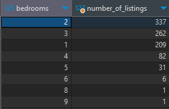
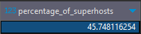
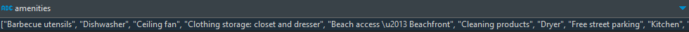
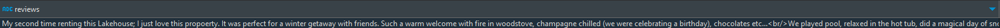

# Airbnb Data Analysis Project

This project analyzes Airbnb data from New Brunswick, Canada, with the goal of profiling top-earning property listings to assist new investors in maximizing rental revenue and profitability. The analysis encompasses data cleaning, preprocessing, annual revenue calculation, identification of high-performing listings, and exploration of key factors contributing to property success. 

Tableau Dashboard: [Link](https://public.tableau.com/views/AirbnbTopEarners_16946383448580/Dashboard1?:language=en-US&:display_count=n&:origin=viz_share_link)
## Technologies Used
- Python
  - Pandas
  - SQLAlchemy
- Jupyter Notebook
- PostgreSQL
- Tableau

## Data Flow Overview


## Data Sources

The project uses three CSV files as data sources imported into PostgreSQL using Python module SQLAlchemy :

- `calendar.csv`: Contains calendar data for Airbnb listings.
- `listings.csv`: Contains detailed information about Airbnb listings.
- `reviews.csv`: Contains guest reviews for Airbnb listings.

## Data Preparation

- The `listings.csv` data is cleaned and transformed to create the `listings_cleaned` table in the PostgreSQL database.
- The `calendar.csv` data is cleaned and transformed to create the `calendar_cleaned` table.
- The `reviews.csv` data is cleaned and transformed to create the `reviews_cleaned` table.

## Data Cleaning (SQL)

The dataset undergoes several data cleaning and preprocessing steps in SQL, utilizing various SQL techniques and concepts to prepare the data for analysis. Here are some examples of data cleaning operations:

### Cleaning `listings.csv`:

- Removing duplicates based on the `id` column.
- Converting the `price` column to a decimal format by removing "$" and "," characters.
- Filtering out rows with NULL values in critical columns like `description`, `room_type`, and more.

### Cleaning `calendar.csv`:

- Removing rows with NULL values in the `listing_id` and `available` columns.
- Aggregating data to calculate the number of nights booked for each listing.

### Cleaning `reviews.csv`:

- Removing rows with NULL values in the `listing_id` and `comments` columns.
- Concatenating reviews for each listing into a single string.

### Creating `listings_detailed` with SQL Join

The `listings_detailed` table was created by joining `listings_cleaned`, `calendar_cleaned`, and `reviews_cleaned` tables using SQL INNER JOINS using `listing_id` as the common key.

The table provides a comprehensive view of each listing, including details, booking statistics, and guest reviews, for further analysis and visualization.

## Data Analysis

Please view ```airbnb_sql_queries.sql``` for detailed queries for analyssi conducted below. 

### Question 1: Which listings make above average annual revenue (Top-Earners)?

To identify top-earning listings, we calculated city-specific average annual revenue using a Common Table Expression (CTE). This approach allowed us to compare individual listings to their respective city averages, revealing high-performing properties within each city.

This method provides a fairer assessment than comparing to the provincial average, as it accounts for variations in demand and pricing across different cities.

The top-earning listings were saved to a table called ```great_listings```.

```sql
-- Calculate average annual revenue by city using a CTE, compare listings to CTE averages, store top-earners in great_listings table

CREATE TABLE great_listings AS(
	WITH avg_rev_city AS(
		SELECT city, AVG(annual_rev) avg_rev
		FROM listings_detailed ld1 
		GROUP BY city
	)
	SELECT ld.*	
	FROM listings_detailed ld
	INNER JOIN avg_rev_city avgc
		ON ld.city = avgc.city
	WHERE annual_rev > avgc.avg_rev
	ORDER BY ld.annual_rev DESC
);

```
<div align="center">
  <table>
    <tr>
      <td align="center">
        
        <p>Common Table Expression (CTE) used in the analysis</p>
      </td>
      <td align="center">
        
        <p>Visualizing the listing selection process</p>
      </td>
    </tr>
  </table>
</div>

**Note:** Moving forward this analysis exclusively examines top-earning listings, and it does not include below-average earners. 

### Question 2: Which city has the highest-earning listings and the most listings?
Our analysis reveals ***Moncton*** has the greatest number of top-earning listings with 150 listings, which makes sense since it is one of the most populated cities in the province. This pattern follows with other populated cities.

The city with the highest average annual revenue is ***Canning*** bringing an annual CAD$375,515 average rental revenue

<div align="center">
  <table>
    <tr>
      <td align="center">
        
        <p>Most # of listings</p>
      </td>
      <td align="center">
        
        <p>Highest Average Annual Revenue</p>
      </td>
    </tr>
    <tr>
      <td colspan="2" align="center">
        
        <p>Tableau Visualization of Listing Information</p>
      </td>
    </tr>
  </table>
</div>

### Question 3: What is the average guest rating and occupancy rate (overall/county/city)?
The top-earning listings have a very high average rating of ***4.84/5.00*** suggesting people really enjoy staying at these properties. These properties also have a  ***75%*** occupancy rate which is well above the [national Canadian average of 27% and provincial average of 47% for 2023](https://www.alltherooms.com/resources/articles/average-airbnb-occupancy-rates-by-city/) . Guests love these properties!

<div align="center">
  <table>
    <tr>
      <td align="center">
        
        <p>Average Rating and Occupancy for Top-Earners</p>
      </td>
      <td align="center">
        
        <p> Average Occupancy Rate by County and City</p>
      </td>
    </tr>
  </table>
</div>

### Question 4: What is the distribution of great listings by bedrooms?

Most top earning-listings had ***2 bedrooms***, followed by 3 bedrooms. This could be because it attracts family, friends or co-workers traveling together but not wanting to sleep together as well as families needing more than one bed at an affordable price point. 



### Percentage of Listings Owned by Superhosts
About ***46%*** of top-earning listings are owned by superhosts. This was surprising since you would expect such well earning properties to have a higher makeup of superhosts. Regardless, the analysis suggests being a superhost is not a key factor (less than 50% of) in driving a property to return above average annual revenue. 



### Textual Analysis (Python Script)

In addition to numerical data analysis, this project includes textual analysis to gain insights from guest reviews and listing amenities. 

Let's begin with an example description and review from our SQL table:






#### Data Processing Steps:

1. **Data Concatenation:** We concatenated all descriptions and guest reviews to create a combined text corpus.
2. **Data Cleaning:** We prepared the combined text corpus by removing non-alphabet characters and HTML tags using regex, preserving essential information.
3. **Tokenization:** The text was tokenized into individual words.
4. **Stopword Removal:** Common stopwords and custom stopwords were removed to focus on meaningful terms using the NLTK module.
5. **Frequency Analysis:** We analyzed the frequency of each amenity/review term to identify the most offered amenities and guest sentiment.

#### Question 6: What are the most offered amenities?:
We can see the most offered amenities in top-earning amenities are  ***Kitchen, Dishes/Silverware, Essentials and Cooking Basics***. [Investing in a kitchen setup and adding cooking basics boosts earning potential by 17% according to other studies conducted ](https://www.thezebra.com/resources/home/airbnb-statistics/), which is supported by our findings. New investors should prioritize these amenities to keep competitive in the market. 

#### Question 7: What are guest saying about these properties?:
Our analysis reveals an overall positive sentiment from guests who stay at top-earning properties. Specifically, the word ***clean*** in the top 5 affirms the importance of clean properties in guest satisfaction and translates to higher earning potential. This is something mentioned often on host forums and is also encouraged by the [airbnb algorithm](https://www.turnify.com/the-importance-of-airbnb-cleaning-why-a-clean-property-is-essential-for-providing-a-positive-guest-experience/#:~:text=In%20fact%2C%20research%20has%20shown,turn%20lead%20to%20more%20bookings.) as it boosts reviews, pushing the property higher leading to more booking and repeat customers. Investors should focus on making the property ***clean and comfortable*** as it is what guests clearly value a lot.

<div align="center">
  <table>
    <tr>
      <td align="center">
        
        <p>Most frequently offered amenities</p>
      </td>
      <td align="center">
        
        <p> Reviews word frequency</p>
      </td>
    </tr>
  </table>
</div>

#### Question 8: What can you expect to earn on average in the province as a top earner?:
The average annual revenue for top-earning properties in the province is ***CA$56,643***. However, this average can be significantly influenced by rare outliers, such as properties in remote or scarce locations or larger houses that command higher rates. These outliers may present unique business opportunities.

To obtain a more typical expectation, consider the median annual revenue. In New Brunswick, Canada, the median annual revenue for top-earning properties is ***CA$49,062***. This figure provides a more realistic view for most investors.

Investors should balance both the average and median figures when assessing potential investments.


### Interactive Dashboard for Investors
Please visit the interactive dashboard where you can see province wide statistics and drill down to more city and county specific statistics to help make investment decisions:  [Tableau Public](https://public.tableau.com/views/AirbnbTopEarners_16946383448580/Dashboard1?:language=en-US&:display_count=n&:origin=viz_share_link)


### Advice to Investors

- **Location Matters:** Choose cities like Moncton and consider areas with high demand to increase the likelihood of achieving top earnings. If you choose to go for exceptionally high-earning cities in remote or unique locations, like Canning, understand these are outliers and balance your expectations with the median annual revenue for a more realistic view.

- **Property Setup:** Focus on properties with 2 bedrooms, a well-equipped kitchen, and essential amenities. These features attract a wide range of travelers.

- **Superhost Status:** While superhost status is beneficial, it's not the sole determinant of success. Focus on providing a top-notch guest experience to attract positive reviews and repeat customers.

- **Cleanliness is Key:** Ensure your property is impeccably clean and well-maintained. Prioritize housekeeping to enhance guest satisfaction and encourage return visits.

- **Continuous Improvement:** Keep monitoring guest feedback and industry trends to adapt and improve your property continually.

- **Explore Interactive Dashboard:** Utilize the interactive dashboard provided in this project to access detailed statistics, helping you make well-informed investment decisions for the city of your choice.

By capitalizing on these insights, investors can strategically position themselves for success in New Brunswick's thriving Airbnb market.


## Future Enhancements
- Explore machine learning models for predicting listing performance.
- Expand the textual analysis to gain deeper insights from guest reviews like sentiment analysis.
- Explore a more thorough profitability analysis by considering potential revenue alongside house costs, maintenance expenses, and other operational costs associated with running an Airbnb rental.

## Acknowledgments

- [InsideAirbnb](http://insideairbnb.com/get-the-data): Data source for this project.
---
**Project by:** Amolvir Taunque